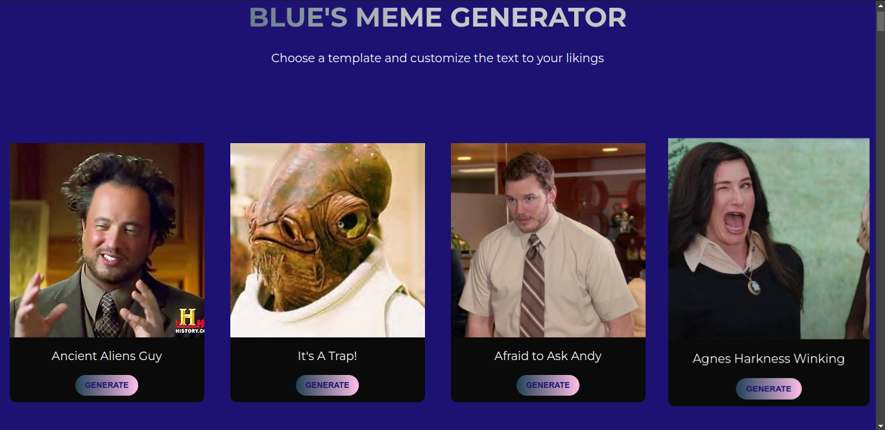
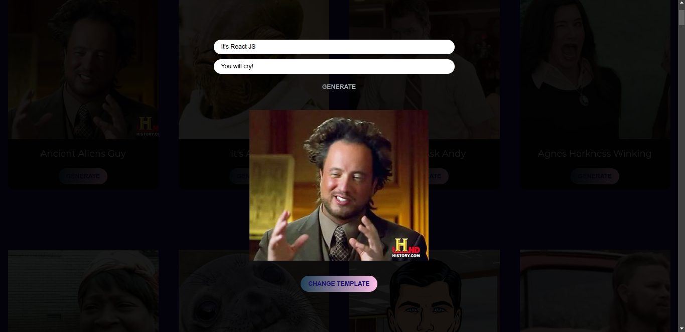
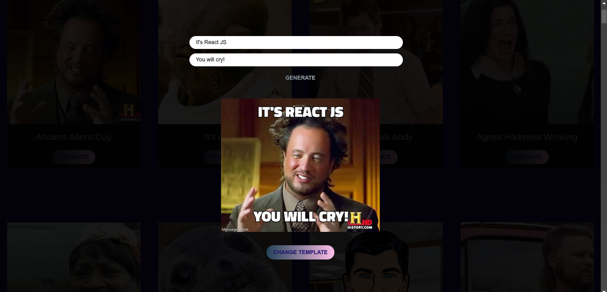

# Project Name

## Table of Contents

- [Overview](#overview)
- [Features](#features)
- [Screenshots](#screenshots)
- [License](#license)

## Overview

The Blue's Meme Generator is a meme generator created by Atiloye Adu, for the purpose of learning and getting familiar with React JS, and also as a fun web app for memers and lovers of meme culture.

It works by getting empty meme templates using a meme site's (memegen) API, and gives users the ability to view and add meme texts to an image. The image can also be saved locally or shared with friends.

If any bugs are spotted or discovered, pls send me an email at: hartiloye2002@outlook.com.

Enjoy :-) ;-).

## Features

- View meme templates
- Add text to templates.
- Generate and share memes created.
- Easy to use.

## Screenshots
#### What to expect:

*Landing*

#### [Another Screenshot Description]

*Editing*

*Finished*

## License

This project is licensed under the [MIT License](LICENSE).
